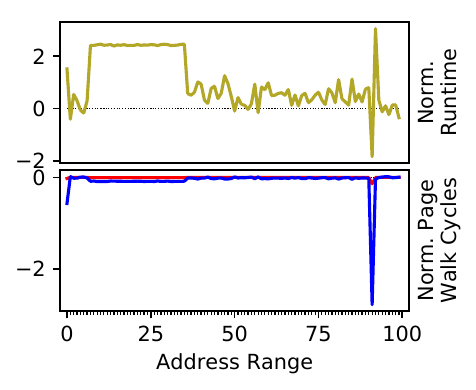
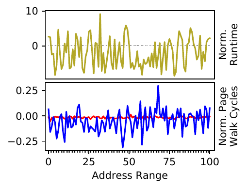
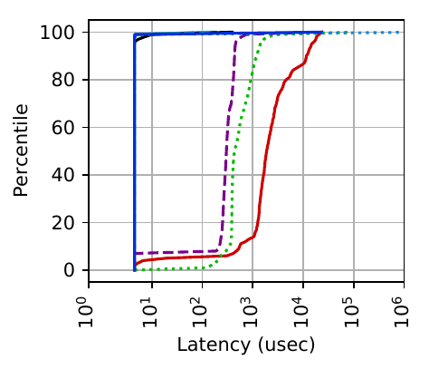

# Artifact package for CBMM paper (ATC'22)

## Overview

This artifact contains:

- `README.md`: this file.
- `paper.pdf`: the accepted version of the paper, without any modifications responding to reviewer requests.
- `cbmm/`: a git submodule containing our primary artifact, the CBMM kernel, which is a modified version of Linux 5.5.8.
- `cbmm-runner/`: a git submodule of our `runner` tool, which runs our experiments.
- `profiles/`: a set of profiles we used in our evaluation. More later.
- `scripts/`:
   - Convenience scripts for running experiments (more in "Detailed Instructions"),
   - Scripts for processing experimental output into a consumable/plottable form,
   - Scripts for plotting experimental results to generate the figures from the paper.
- `figures/`: copies of the figures from the paper.

Since our artifact is a kernel, our evaluation uses two machines: one to drive experiments (the _driver_ machine) and one for the experiments to run on (the _test_ machine). We do it this way so that our experiments can run on bare metal without virtualization overheads to muddle the results. We use two separate machines because it makes automation and scripting easier.

The CBMM kernel runs on the _test_ machine, while the `runner` program runs on the _driver_ machine.

## Artifact Claims

Running the experiments as specified below on similar hardware to our own setup (described in Section 5.1) should allow the reviewer to generate comparable results to those in the accepted version of the paper.

Specifically, our paper's key claims are:
1. CBMM improves page fault tail latency, our measure of MM system behavioral consistency, compared to Linux and HawkEye (Figures 2 and 4).
2. CBMM does not regress application runtime, and under fragmentation can often significantly improve runtime compared to Linux and/or HawkEye (Figure 5).
3. CBMM often uses huge pages more frugally than Linux or HawkEye despite getting better tail latency and comparable (or better) performance (Figure 6).
4. CBMM has benefits even when profiles are imprecise (Section 5.5, 5.6).

Because running all experiments is time and resource intensive, we provide a screencast and intermediate results for the reviewers. This should allow generation of checkable partial results in a reasonable amount of time.

## Hardware and Software Requirements

_Driver_ machine:
- A recent Linux distro with standard utilities. We ran extensively on Ubuntu 18.04 and Ubuntu 20.04.
- [Rust](https://www.rust-lang.org/tools/install) 1.31 or greater. The `runner` is written in rust.
- Needs to have _passwordless_ SSH access to the _test_ machine. This is used for automatedly running commands for the experiments.
   - The network needs to be _stable_ for long periods of time, as the SSH connection is maintained while long-running commands run.
- No significant memory, CPU, or disk requirements...
- The artifact evaluator will need access to a SPEC2017 ISO image. We don't include it because it is against the License :'(
- **The driver machine is _not_ modified by the runner or any experiments.**

_Test_ machine:
- The hardware specs of our test machine are in Section 5.1 of the paper.
   - NOTE: the machine should have close to 192GB of memory. We chose our workload sizes carefully so as not to over- or under-pressure memory but have representative results.
   - NOTE: the machine needs >=50GB free disk space, as building and running the artifact can produce a lot of output.
- Centos 7
   - We will install the CBMM kernel in the instructions below.
- Needs to have internet access to download software packages through `yum`, `git`, `wget`, `curl`.

----

## Getting Started

We will clone and build the `runner` program on the _driver_ machine. The `runner` will then be used to set up the _test_ machine as needed. The `runner` can subsequently be used to run any experiments in the paper.

There are two primary configurations: Linux/CBMM and HawkEye. The Linux/CBMM configuration is used for all experiments on plain Linux or CBMM and is based on the 5.5.8 kernel. The HawkEye configuration is used for all HawkEye experiments (used as a comparison system in our paper). We recommend running all Linux/CBMM experiments across figures and then all HawkEye experiments so as to avoid reinstalling kernels multiple times. Alternately, one can set up two _test_ machines (one for Linux/CBMM and one for HawkEye), which could save time.

NOTE: We include `cbmm-runner` and `cbmm` in this repository for archival reasons, but our scripts download them anyway from github.

### Setup

**Run all of these steps on the _driver_ machine**, _not_ the _test_ machine.

1. Clone this repo.

    ```sh
    git clone https://github.com/multifacet/cbmm-artifact
    ```

2. Initialize the `runner` submodule.

   ```sh
   cd cbmm-artifact
   git submodule update --init -- cbmm-runner
   git submodule update --init -- cbmm
   ```

3. Build the `runner` using Rust's `cargo` tool. This will download dependencies and build and link the tool. It should take <10 minutes to complete on an average machine.

   ```sh
   cd cbmm-runner/runner
   cargo build
   ```

4. Use the `runner` to start setting up the _test_ machine. This should take ~1 hour. The command should produce lots of output about the commands being run and their output. The commands being run are on the _test_ machine (over SSH), not the _driver_.

   In the following commands, replace:
      - `{MACHINE}` with the `ip:port` of the _test_ machine (e.g., `foo.cs.wisc.edu:22`),
      - `{USER}` with the username on the _test_ machine (e.g., `markm`),
      - `/path/to/spec2017.iso` with the path to your ISO,
      - `--swap sdb` with the proper partition name for your swap partition.

   ```sh
   # Clones/installs/builds a bunch of dependencies and benchmarks.
   ./target/debug/runner setup00000 {MACHINE} {USER} --centos7 --jemalloc \
      --clone_wkspc --firewall --host_bmks --host_dep \
      --swap sdb \
      --spec_2017 /path/to/spec2017.iso
   ```

   **Troubleshooting**
      - Copying the SPEC2017 ISO hangs or fails.
         - Make sure that SSH'ing into the _test_ machine is passwordless and requires no interaction. For example, log into the machine manually once to address any fingerprint confirmations that SSH may generate.
      - On CloudLab, root partition is only 16GB and runs out of space.
         - Pass the `--resize_root` flag, which expands the size of the main partition.
      - On my machine, `/dev/sda` may point to different devices after a reboot.
         - Pass the `--unstable_device_names` flag, which causes the runner to use device UUIDs instead.

5. At this point, we need to choose a kernel to install. For Linux/CBMM experiments, choose **Option A**. To setup a machine for HawkEye experiments, choose **Option B**. In the future, you can switch to the other configuration by just executing the command for the other option (you don't need to rerun the previous steps).

   **Option A: Linux/CBMM** Use the `runner` to install CBMM (our system) on the _test_ machine. This should take about ~1 hour. The command should produce lots of output about the commands being run and their output. The commands being run are on the _test_ machine (over SSH), not the _driver_.

   ```sh
   # Clones and builds the CBMM kernel at the given git commit hash.
   ./target/debug/runner setup00003 {MACHINE} {USER} \
      ffc5a23759fcbf862ed68eaad460eeb06d79431d \
      --https github.com/multifacet/cbmm \
      +CONFIG_TRANSPARENT_HUGEPAGE +CONFIG_MM_ECON -CONFIG_PAGE_TABLE_ISOLATION \
      -CONFIG_RETPOLINE +CONFIG_GDB_SCRIPTS +CONFIG_FRAME_POINTERS +CONFIG_IKHEADERS \
      +CONFIG_SLAB_FREELIST_RANDOM +CONFIG_SHUFFLE_PAGE_ALLOCATOR
   ```

   **Option B: HawkEye** Use the `runner` to install HawkEye (experimental comparison) on the _test_ machine. This should take about ~1 hour. The command should produce lots of output about the commands being run and their output. The commands being run are on the _test_ machine (over SSH), not the _driver_.

   ```sh
   ./target/debug/runner setup00004 {MACHINE} {USER}
   ```

6. Build the `read-pftrace` tool which is used to read the page fault latency traces in Figures 2 and 4. They are in a compressed binary format to save space.

   ```sh
   cd cbmm-artifacts/cbmm/mm/read-pftrace
   cargo build --release
   ```

7. Create a directory on the _driver_ machine (doesn't matter where) to store results generated throughout the evaluation. We will copy results back to this directory from the _test_ machine for further processing and plotting. Throughout this document, we will refer to this directory as `$RESULTS_DIR`.

8. **Congratulations!** You should now have a fully-set-up _driver_ and _test_ machine pair. We can now begin running experiments.

### Kick the tires (some small tests)

The following commands run fast (<15 minutes) test experiments. The commands should be run on _driver_, but they will cause the experiments to run on _test_. In each command,
   - `{MACHINE}` is the `ip:port` of the _test_ machine (e.g., `foo.cs.wisc.edu:22`),
   - `{USER}` is the username on the _test_ machine (e.g., `markm`),

In each case, the _test_ machine will be reboot, will have a bunch of configuration setting set (e.g., CPU scaling governor, etc), will run the given experiment, and will produce a collection of output files with the same name and different extensions in `~/vm_shared/` on the _test_ machine.

1. Run the `thp_ubmk` microbenchmark with size 10GB, collecting the contents of `/proc/[pid]/smaps` periodically. This should work for either configuration (Linux/CBMM or HawkEye).

   ```sh
   ./target/debug/runner exp00010 {MACHINE} {USER} --smaps_periodic   thp_ubmk 10
   ```

2. Run the `mix` workload with size 10GB and produce profiling information for eager paging.  This should work for either configuration (Linux/CBMM or HawkEye).

   ```sh
   ./target/debug/runner exp00012 {MACHINE} {USER} --eagerprofile 60 \
      --instrument redis-server mixycsb 10 --op_count 900000 \
      --read_prop 0.50 --update_prop 0.25
   ```

3. Run the `memcached` workload with size 10GB on CBMM with the given profile and collect page fault latency information.  This will only work for the Linux/CBMM configuration.

   ```sh
   ./target/debug/runner exp00010 {MACHINE} {USER} --memstats --pftrace \
      --pftrace_threshold 10000  --asynczero --mm_econ \
      --mm_econ_benefit_file ../../profiles/memcached.csv \
      memcachedycsb 150 --op_count 9400000 --read_prop 0.99 --update_prop 0.01
   ```

----

## Detailed Instructions

We provide commands for generating the data in each of the figures in the paper and plotting them. All commands should be run on the _driver_ machine, not the _test_ machine.

In the paper, we run most experiments five times and use the median to reduce variance; we recommend the reviewers also do so. Often, collecting and processing results is tedious and/or error prone to do by hand, so we provide several spreadsheet templates we used ourselves, along with several screencasts explaining how to use them.

Generating all of the results is time and resource intensive (it took two of the authors two weeks on ~50 machines). The following table shows the time it took us to run a single experiment of each workload. The reviewer may want to generate partial results from the paper in the interest of time.

| Workload    | Rought time estimate |
|-------------|----------------------|
| canneal     | 4 hours              |
| mongodb     | 4 hours              |
| xz          | 3 hours              |
| mix         | 1 hour               |
| memcached   | 30 minutes           |
| mcf         | 20 minutes           |
| thp\_ubmk   | 10 minutes           |

In the paper, Linux 5.5.8 is the comparison baseline, HawkEye is an additional comparison, and CBMM is our proposed system. Linux and CBMM experiments use the same kernel (Linux is CBMM with the CBMM-ish features disabled), while HawkEye uses a different kernel (from the authors of that paper).

In the remainder of this document we give detailed instructions for generating results for each of our major claims and their corresponding figures, organized by figure. Commands explicitly labeled with **Linux/CBMM** should be run with the **Linux/CBMM** configuration; those labeled with **HawkEye** should be run with the **HawkEye** configuration; those not labeled can be run in either configuration. In the interest of the reviewer's time, we would recommend running Linux/CBMM experiments for multiple figures before switching configurations to run HawkEye experiments. This will reduce time spent switching between kernels (see step 5 of Getting Started for instructions to switch kernels).

### Figure 5


We start with Figure 5 because these results are used in some of the other figures too (e.g., to compute page fault rate). These experiments capture the total runtime of the workloads for each kernel and fragmentation setting. Note that you will need to run experiments with both kernel configurations (Linux/CBMM and HawkEye; see Getting Started, step 5).

Once again, all of these commands are meant to be run on the _driver_ machine, not the _test_ machine.

1. Run the experiments. We recommend repeating this step five times, generating five sets of results, to reduce variance.

   **Linux/CBMM**

   ```sh
   cd cbmm-runner/runner
   ../../scripts/figure-5-linux-cbmm.sh
   ```

   **HawkEye**

   ```sh
   cd cbmm-runner/runner
   ../../scripts/figure-5-hawkeye.sh
   ```

2. Copy the results back from the _test_ machine to the _driver_ machine. We recommend `rsync` for this, as it supports compression, which can shorten network transfers significantly.

   ```sh
   rsync -avzP {MACHINE}:~/vm_shared/ $RESULTS_DIR
   ```

3. Process the output. For each experiment, we want to get the total runtime (median of 5 runs). We found this easiest to do with a spreadsheet. We've provided a blank copy of our spreadsheet [here for you to clone (File > Make a Copy)](https://docs.google.com/spreadsheets/d/1KA-ybuvdKClV0VWzlaM6qtJjsZVQMIn2BHZ642A_vUY/edit?usp=sharing). Please refer to [this screencast](https://youtu.be/RpBI6XHbVVA) explaining how to use the spreadsheet and generate a CSV of the results for the next step.

   For `xz`, `mcf`, `canneal`, `mix`, and `thp_ubmk`, the correct value can be found in the `$OUTPUT.runtime` file from the experiment's output.

   ```sh
   cat $OUTPUT.runtime
   ```

   For `mongodb` and `memcached` the correct value is the "[OVERALL] RunTime(ms)" reported by YCSB in `$OUTPUT.ycsb`:

   ```sh
   #           vvvv Note the extension -- .ycsb, not .runtime
   cat $OUTPUT.ycsb | grep OVERALL | grep RunTime | awk '{print $3}'
   ```

   We include our data as [figures/fig5.csv](./figures/fig5.csv).

4. Pass the CSV to the plotting script to produce Figure 5:

   ```sh
   ./scripts/plot-perf.py $DATA.csv
   ```

### Figure 1

   

This figure contains the results of ~4000 experiments. Please see [this screencast][fig1sc] for our procedure to generate these results. The high-level procedure and rationale are described in Section 2.1 of the paper. We give only examples here for brevity, but the full set of commands to run experiments is included in `./scripts/figure-1.sh`. We include the commands for completeness, but we also include the final results (the profiles) in `profiles/`, for your use in the remaining experiments.

1. Collect `/proc/[pid]/smaps` for each workload. This gives the address space layout for the profiled process. For example, for `xz`:

   ```sh
   ./target/debug/runner exp00010 {MACHINE} {USER} --smaps_periodic   hacky_spec17 xz --spec_size 76800 --input  training
   ```

2. Profile the workloads for eager paging. For example, for `xz`:

   ```sh
   ./target/debug/runner exp00010 {MACHINE} {USER} --eagerprofile 60   hacky_spec17 xz --spec_size 76800 --input  training
   ```

3. Copy the results back from the _test_ machine to the _driver_ machine. We recommend `rsync` for this, as it supports compression.

   ```sh
   rsync -avzP {MACHINE}:~/vm_shared/ $RESULTS_DIR
   ```

4. Process the smaps output and split the address space into 100 equally-sized chunks.

   ```sh
   cat $RESULTS_DIR/$OUTPUT.smaps | ./scripts/process-smaps.py
   ```

   Example output:

   ```txt
   0x400000 0x435000 0 {'/users/bijan/0sim-workspace/bmks/spec2017/benchspec/CPU/657.xz_s/run/run_base_refspeed_markm-thp-m64.0000/xz_s'}
   0x634000 0x63c000 0 {'', '/users/bijan/0sim-workspace/bmks/spec2017/benchspec/CPU/657.xz_s/run/run_base_refspeed_markm-thp-m64.0000/xz_s'}
   0x7fcbefc00000 0x7fcbf3200000 27 {''}
   0x7fcbf337d000 0x7ffff6600000 106521 {''}
   0x7ffff670c000 0x7ffff7dfd000 11 {'', '/usr/lib64/libgcc_s-4.8.5-20150702.so.1', '/usr/local/lib/libjemalloc.so.2', '/usr/lib64/libpthread-2.17.so', '/usr/lib64/libdl-2.17.so', '/usr/lib64/libgomp.so.1.0.0', '/usr/lib64/libc-2.17.so', '/usr/lib64/ld-2.17.so', '/usr/lib64/libstdc++.so.6.0.19', '/usr/lib64/libm-2.17.so'}
   0x7ffff7fdd000 0x7ffff7fe6000 0 {''}
   0x7ffff7ff6000 0x7ffff7fff000 0 {'', '[vdso]', '/usr/lib64/ld-2.17.so', '[vvar]'}
   0x7ffffffde000 0x7ffffffff000 0 {'[stack]'}
   0xffffffffff600000 0xffffffffff601000 0 {'[vsyscall]'}
   ```

   Manually select ranges to profile. Usually, this is the largest mapped area from the output of `process-smaps.py`. In the example above, we would likely want to use `0x7fcbefc00000 - 0x7ffff7dfd000`.

   ```sh
   ./scripts/huge_range_compute.py <start> <end> <nslices> | tail -n 1

   # For example:
   ./scripts/huge_range_compute.py 0x7fcbefc00000 0x7ffff7dfd000 100 | tail -n 1
   ```

   Example output:

   ```
   0x0 0x7fcc76400000,0x7fcc76400000 0x7fccfcc00000,0x7fccfcc00000 0x7fcd83400000,0x7fcd83400000 0x7fce09c00000,0x7fce09c00000 0x7fce90400000,0x7fce90400000 0x7fcf16c00000,0x7fcf16c00000 0x7fcf9d400000,0x7fcf9d400000 0x7fd023c00000,0x7fd023c00000 0x7fd0aa400000,0x7fd0aa400000 0x7fd130c00000,0x7fd130c00000 0x7fd1b7400000,0x7fd1b7400000 0x7fd23dc00000,0x7fd23dc00000 0x7fd2c4400000,0x7fd2c4400000 0x7fd34ac00000,0x7fd34ac00000 0x7fd3d1400000,0x7fd3d1400000 0x7fd457c00000,0x7fd457c00000 0x7fd4de400000,0x7fd4de400000 0x7fd564c00000,0x7fd564c00000 0x7fd5eb400000,0x7fd5eb400000 0x7fd671c00000,0x7fd671c00000 0x7fd6f8400000,0x7fd6f8400000 0x7fd77ec00000,0x7fd77ec00000 0x7fd805400000,0x7fd805400000 0x7fd88bc00000,0x7fd88bc00000 0x7fd912400000,0x7fd912400000 0x7fd998c00000,0x7fd998c00000 0x7fda1f400000,0x7fda1f400000 0x7fdaa5c00000,0x7fdaa5c00000 0x7fdb2c400000,0x7fdb2c400000 0x7fdbb2c00000,0x7fdbb2c00000 0x7fdc39400000,0x7fdc39400000 0x7fdcbfc00000,0x7fdcbfc00000 0x7fdd46400000,0x7fdd46400000 0x7fddccc00000,0x7fddccc00000 0x7fde53400000,0x7fde53400000 0x7fded9c00000,0x7fded9c00000 0x7fdf60400000,0x7fdf60400000 0x7fdfe6c00000,0x7fdfe6c00000 0x7fe06d400000,0x7fe06d400000 0x7fe0f3c00000,0x7fe0f3c00000 0x7fe17a400000,0x7fe17a400000 0x7fe200c00000,0x7fe200c00000 0x7fe287400000,0x7fe287400000 0x7fe30dc00000,0x7fe30dc00000 0x7fe394400000,0x7fe394400000 0x7fe41ac00000,0x7fe41ac00000 0x7fe4a1400000,0x7fe4a1400000 0x7fe527c00000,0x7fe527c00000 0x7fe5ae400000,0x7fe5ae400000 0x7fe634c00000,0x7fe634c00000 0x7fe6bb400000,0x7fe6bb400000 0x7fe741c00000,0x7fe741c00000 0x7fe7c8400000,0x7fe7c8400000 0x7fe84ec00000,0x7fe84ec00000 0x7fe8d5400000,0x7fe8d5400000 0x7fe95bc00000,0x7fe95bc00000 0x7fe9e2400000,0x7fe9e2400000 0x7fea68c00000,0x7fea68c00000 0x7feaef400000,0x7feaef400000 0x7feb75c00000,0x7feb75c00000 0x7febfc400000,0x7febfc400000 0x7fec82c00000,0x7fec82c00000 0x7fed09400000,0x7fed09400000 0x7fed8fc00000,0x7fed8fc00000 0x7fee16400000,0x7fee16400000 0x7fee9cc00000,0x7fee9cc00000 0x7fef23400000,0x7fef23400000 0x7fefa9c00000,0x7fefa9c00000 0x7ff030400000,0x7ff030400000 0x7ff0b6c00000,0x7ff0b6c00000 0x7ff13d400000,0x7ff13d400000 0x7ff1c3c00000,0x7ff1c3c00000 0x7ff24a400000,0x7ff24a400000 0x7ff2d0c00000,0x7ff2d0c00000 0x7ff357400000,0x7ff357400000 0x7ff3ddc00000,0x7ff3ddc00000 0x7ff464400000,0x7ff464400000 0x7ff4eac00000,0x7ff4eac00000 0x7ff571400000,0x7ff571400000 0x7ff5f7c00000,0x7ff5f7c00000 0x7ff67e400000,0x7ff67e400000 0x7ff704c00000,0x7ff704c00000 0x7ff78b400000,0x7ff78b400000 0x7ff811c00000,0x7ff811c00000 0x7ff898400000,0x7ff898400000 0x7ff91ec00000,0x7ff91ec00000 0x7ff9a5400000,0x7ff9a5400000 0x7ffa2bc00000,0x7ffa2bc00000 0x7ffab2400000,0x7ffab2400000 0x7ffb38c00000,0x7ffb38c00000 0x7ffbbf400000,0x7ffbbf400000 0x7ffc45c00000,0x7ffc45c00000 0x7ffccc400000,0x7ffccc400000 0x7ffd52c00000,0x7ffd52c00000 0x7ffdd9400000,0x7ffdd9400000 0x7ffe5fc00000,0x7ffe5fc00000 0x7ffee6400000,0x7ffee6400000 0x7fff6cc00000,0x7fff6cc00000 0x7ffff3400000,0x7ffff3400000 0x800079c00000
   ```

   These are the address space slices we will use for our profiling.

5. For each `<start> <end>,...` in the list above, run the following command (we ran each command 5x to reduce variability):

   ```sh
   ./target/debug/runner exp00010 {MACHINE} {USER}  --thp_huge_addr_ranges {ADDR} \
      --end --mmu_overhead hacky_spec17 xz --spec_size 76800 --input  training
   ```

   where `{ADDR}` is replaced by an address range from the above list.

   We used [`jobserver`] to manage this set of experiments for us:

   ```sh
   j job matrix add -x 5 --timeout 600 --max_failures 5 exp-c220g5 "exp00010 {MACHINE} {USER}  --thp_huge_addr_ranges {ADDR} --end  --mmu_overhead    hacky_spec17 xz --spec_size 76800 --input  training" $RESULTS_DIR "ADDR=0x0 0x7fcc76400000,0x7fcc76400000 0x7fccfcc00000,0x7fccfcc00000 0x7fcd83400000,0x7fcd83400000 0x7fce09c00000,0x7fce09c00000 0x7fce90400000,0x7fce90400000 0x7fcf16c00000,0x7fcf16c00000 0x7fcf9d400000,0x7fcf9d400000 0x7fd023c00000,0x7fd023c00000 0x7fd0aa400000,0x7fd0aa400000 0x7fd130c00000,0x7fd130c00000 0x7fd1b7400000,0x7fd1b7400000 0x7fd23dc00000,0x7fd23dc00000 0x7fd2c4400000,0x7fd2c4400000 0x7fd34ac00000,0x7fd34ac00000 0x7fd3d1400000,0x7fd3d1400000 0x7fd457c00000,0x7fd457c00000 0x7fd4de400000,0x7fd4de400000 0x7fd564c00000,0x7fd564c00000 0x7fd5eb400000,0x7fd5eb400000 0x7fd671c00000,0x7fd671c00000 0x7fd6f8400000,0x7fd6f8400000 0x7fd77ec00000,0x7fd77ec00000 0x7fd805400000,0x7fd805400000 0x7fd88bc00000,0x7fd88bc00000 0x7fd912400000,0x7fd912400000 0x7fd998c00000,0x7fd998c00000 0x7fda1f400000,0x7fda1f400000 0x7fdaa5c00000,0x7fdaa5c00000 0x7fdb2c400000,0x7fdb2c400000 0x7fdbb2c00000,0x7fdbb2c00000 0x7fdc39400000,0x7fdc39400000 0x7fdcbfc00000,0x7fdcbfc00000 0x7fdd46400000,0x7fdd46400000 0x7fddccc00000,0x7fddccc00000 0x7fde53400000,0x7fde53400000 0x7fded9c00000,0x7fded9c00000 0x7fdf60400000,0x7fdf60400000 0x7fdfe6c00000,0x7fdfe6c00000 0x7fe06d400000,0x7fe06d400000 0x7fe0f3c00000,0x7fe0f3c00000 0x7fe17a400000,0x7fe17a400000 0x7fe200c00000,0x7fe200c00000 0x7fe287400000,0x7fe287400000 0x7fe30dc00000,0x7fe30dc00000 0x7fe394400000,0x7fe394400000 0x7fe41ac00000,0x7fe41ac00000 0x7fe4a1400000,0x7fe4a1400000 0x7fe527c00000,0x7fe527c00000 0x7fe5ae400000,0x7fe5ae400000 0x7fe634c00000,0x7fe634c00000 0x7fe6bb400000,0x7fe6bb400000 0x7fe741c00000,0x7fe741c00000 0x7fe7c8400000,0x7fe7c8400000 0x7fe84ec00000,0x7fe84ec00000 0x7fe8d5400000,0x7fe8d5400000 0x7fe95bc00000,0x7fe95bc00000 0x7fe9e2400000,0x7fe9e2400000 0x7fea68c00000,0x7fea68c00000 0x7feaef400000,0x7feaef400000 0x7feb75c00000,0x7feb75c00000 0x7febfc400000,0x7febfc400000 0x7fec82c00000,0x7fec82c00000 0x7fed09400000,0x7fed09400000 0x7fed8fc00000,0x7fed8fc00000 0x7fee16400000,0x7fee16400000 0x7fee9cc00000,0x7fee9cc00000 0x7fef23400000,0x7fef23400000 0x7fefa9c00000,0x7fefa9c00000 0x7ff030400000,0x7ff030400000 0x7ff0b6c00000,0x7ff0b6c00000 0x7ff13d400000,0x7ff13d400000 0x7ff1c3c00000,0x7ff1c3c00000 0x7ff24a400000,0x7ff24a400000 0x7ff2d0c00000,0x7ff2d0c00000 0x7ff357400000,0x7ff357400000 0x7ff3ddc00000,0x7ff3ddc00000 0x7ff464400000,0x7ff464400000 0x7ff4eac00000,0x7ff4eac00000 0x7ff571400000,0x7ff571400000 0x7ff5f7c00000,0x7ff5f7c00000 0x7ff67e400000,0x7ff67e400000 0x7ff704c00000,0x7ff704c00000 0x7ff78b400000,0x7ff78b400000 0x7ff811c00000,0x7ff811c00000 0x7ff898400000,0x7ff898400000 0x7ff91ec00000,0x7ff91ec00000 0x7ff9a5400000,0x7ff9a5400000 0x7ffa2bc00000,0x7ffa2bc00000 0x7ffab2400000,0x7ffab2400000 0x7ffb38c00000,0x7ffb38c00000 0x7ffbbf400000,0x7ffbbf400000 0x7ffc45c00000,0x7ffc45c00000 0x7ffccc400000,0x7ffccc400000 0x7ffd52c00000,0x7ffd52c00000 0x7ffdd9400000,0x7ffdd9400000 0x7ffe5fc00000,0x7ffe5fc00000 0x7ffee6400000,0x7ffee6400000 0x7fff6cc00000,0x7fff6cc00000 0x7ffff3400000,0x7ffff3400000 0x800079c00000"
   ```

6. For each output file from the experiments above, run `./scripts/extract-ranges3.py` to extract the data from the experiment output. The data will be a collection of metadata and performance counters. We once again used [`jobserver`] to help with this:

   ```sh
   j job stat --only_done --results_path mmu --cmd --csv --jid --mapper ./scripts/extract-ranges3.py --id $MATRIX_ID_FROM_PREVIOUS_CMD > /tmp/data.csv
   ```

7. We also want to run the control experiments (no huge pages and Linux THP):

   ```sh
   j job matrix add -x 5 --timeout 600 --max_failures 5 exp-c220g5 "exp00010 {MACHINE} {USER}  {THP}  --mmu_overhead    hacky_spec17 xz --spec_size 76800 --input  training" $RESULTS_DIR "THP=,--disable_thp"
   ```

8. As with the range experiments, we want to extract the data form the experimental output as a CSV using the `./scripts/extract3.py` script:

   ```sh
   j job stat --only_done --results_path mmu --cmd --csv --jid --mapper ./scripts/extract3.py --id $MATRIX_ID_FROM_PREVIOUS_CMD > /tmp/data-nt.csv
   ```

9. We then imported the CSV to spreadsheet software and used it to produce plots and statistics. Please see [the aforementioned screencast][fig1sc].

   [Here is a template](https://docs.google.com/spreadsheets/d/1KjVAH_flvBbhQdzR9HDoIr242VkaB7uE1z6BvItZAoA/edit?usp=sharing) which you can clone to follow along with the screencast.

   We include our data in the following CSVs. These can be imported directly into the `Data` sheet of the aforementioned spreadsheet (no need to do the cleanup mentioned in the screencast):

   Workload | CSV
   ---------|--------
   xz       | [Link](./figures/fig1-xz.csv)
   memcached| [Link](./figures/fig1-memcached.csv)
   mcf      | [Link](./figures/fig1-mcf.csv)
   mongodb  | [Link](./figures/fig1-mongodb.csv)
   canneal  | [Link](./figures/fig1-canneal.csv)
   mix      | [Link](./figures/fig1-mix.csv)

10. Finally, we want to use this data to generate the profiles for CBMM. For each workload, we want to combine the profiling information for huge page benefits and eager paging. For example, for `xz`:

   ```sh
   ./scripts/generate-profile2.py $HPFILE.csv $OUTPUT.eagerprofile xz-profile.csv
   ```

   where `$HPFILE.csv` is the downloaded contents of the spreadsheet's `Per-page-benefits` tab, and `$OUTPUT.eagerprofile` is the file from the output of the eager profiling experiments run in step 2. The output file is `xz-profile.csv`, which can be passed to CBMM as a profile.

[`jobserver`]: https://github.com/mark-i-m/jobserver
[fig1sc]: https://youtu.be/oT4_nvhhZQc

### Figure 2


   

These experiments measure page fault latency on Linux (v5.5.8) for each of the workloads we measured.

1. Run the experiments.

   Note that this script runs all experiments sequentially, which would take multiple days. Feel free to comment out some experiments (lines in the `figure-2.sh` script) to produce partial results.

    ```sh
    cd cbmm-runner/runner
    ../../scripts/figure-2.sh
    ```

2. Copy the results back from the _test_ machine to the _driver_ machine. We recommend `rsync` for this, as it supports compression.

   ```sh
   rsync -avzP {MACHINE}:~/vm_shared/ $RESULTS_DIR
   ```

3. Process the output to generate plots. For each workload, let `$RESULTS_PATH` be the path to the output (in the `$RESULTS_DIR` directory). Then, the following command generates the subplots of Figure 2:

   ```sh
   cd cbmm-artifact
   ./scripts/cdf.py $(./cbmm/mm/read-pftrace/target/release/read-pftrace --cli-only \
      --exclude NOT_ANON --exclude SWAP --other-category 600 \
      -- $RESULTS_PATH.{pftrace,rejected} 10000)
   ```

### Figure 4


     

These experiments are similar to Figure 2. They collect the same data as Figure 2, but on HawkEye and CBMM, too. Additionally, we will process them differently to generate different plots. Note that you will need to run experiments with both kernel configurations (Linux/CBMM and HawkEye; see Getting Started, step 5).

1. Run the experiments.

   Note that we can reuse the results from the Figure 2 experiments for Linux, so `figure-4.sh` does not run them.

   Note that these scripts runs all experiments sequentially, which would take multiple days. Feel free to comment out some experiments (lines in the `figure-4-*.sh` scripts) to produce partial results.

   **Linux/CBMM**

    ```sh
    cd cbmm-runner/runner
    ../../scripts/figure-2.sh           # Linux
    ../../scripts/figure-4-cbmm.sh      # CBMM
    ```

    **HawkEye**

    ```sh
    cd cbmm-runner/runner
    ../../scripts/figure-4-hawkeye.sh
    ```

2. Copy the results back from the _test_ machine to the _driver_ machine. We recommend `rsync` for this, as it supports compression.

   ```sh
   rsync -avzP {MACHINE}:~/vm_shared/ $RESULTS_DIR
   ```

3. Process the output to compute the page _count_ for each workload. We will use these to compute the page fault _rate_.

   For each workload, let
   - `$LINUX_RESULTS` be the results of the Linux experiment for this workload and fragmentation setting,
   - `$HAWKEYE_RESULTS` be the results of the Hawkeye experiment ...
   - `$CBMM_RESULTS` be the results of the CBMM experiment...

   To get the page fault count for a particular workload, kernel, and fragmentation setting from the trace, use the following commands:

   ```sh
   # Linux
   ./cbmm/mm/read-pftrace/target/release/read-pftrace --tail 10 --combined --cli-only --exclude NOT_ANON --exclude SWAP --  $LINUX_RESULTS.{pftrace,rejected} 10000 | sed 's/none(\([0-9]\+\)).*/\1/g'

   # CBMM
   ./cbmm/mm/read-pftrace/target/release/read-pftrace --tail 10 --combined --cli-only --exclude NOT_ANON --exclude SWAP --  $CBMM_RESULTS.{pftrace,rejected} 10000  | sed 's/none(\([0-9]\+\)).*/\1/g'

   # HawkEye
   FREQ=2600 ./scripts/bpf-pftrace-percentiles.py $HAWKEYE_RESULTS.pftrace 3846 10 | sed 's/none(\([0-9]\+\)).*/\1/g'
   ```

   We can now compute the page fault _rate_ as (_page fault count_) / (_workload runtime_), where the count comes from the above commands, and the runtime comes from the Figure 5 results.

   To allow the reviewer to generate plots without running all Figure 4 and 5 experiments, we provide the rates used in the paper in the following tables:

   **Unfragmented**

   Workload | Kernel | Page Fault Rate
   ---------|--------|----------------
   xz       | Linux  | 0.64
   memcached| Linux  | 0.67
   mcf      | Linux  | 0.04
   mongodb  | Linux  | 2.53
   canneal  | Linux  | 1.88
   mix      | Linux  | 17.55
   ---------|--------|-----------------
   xz       | CBMM   | 13.23
   memcached| CBMM   | 26.84
   mcf      | CBMM   | 0.84
   mongodb  | CBMM   | 1.70
   canneal  | CBMM   | 6.91
   mix      | CBMM   | 48.63
   ---------|--------|-----------------
   xz       | HawkEye| 8.48
   memcached| HawkEye| 32.49
   mcf      | HawkEye| 0.19
   mongodb  | HawkEye| 7.72
   canneal  | HawkEye| --
   mix      | HawkEye| 39.88

   **Fragmented**

   Workload | Kernel | Page Fault Rate
   ---------|--------|----------------
   xz       | Linux  | 4.54
   memcached| Linux  | 1.49
   mcf      | Linux  | 0.12
   mongodb  | Linux  | 2.55
   canneal  | Linux  | 1.52
   mix      | Linux  | 17.73
   ---------|--------|-----------------
   xz       | CBMM   | 13.32
   memcached| CBMM   | 66.65
   mcf      | CBMM   | 3.13
   mongodb  | CBMM   | 2.94
   canneal  | CBMM   | 6.31
   mix      | CBMM   | 63.66
   ---------|--------|-----------------
   xz       | HawkEye| 8.29
   memcached| HawkEye| 55.82
   mcf      | HawkEye| 9.45
   mongodb  | HawkEye| 3.45
   canneal  | HawkEye| 5.31
   mix      | HawkEye| 58.54

4. Process the output to generate plots. For each workload, let
   - `$LINUX_SCALE` be the page fault rate in faults/second for this workload and fragmentation setting, as computed in the previous step,
   - `$HAWKEYE_SCALE` be the page fault rate in faults/second ...,
   - `$CBMM_SCALE` be the page fault rate in faults/second ...,

   Then, we can produce the subplot of Figure 4 representing a particular workload and fragmentation setting as follows:

   ```sh
   # Compute percentiles for each plot...
   ./cbmm/mm/read-pftrace/target/release/read-pftrace --tail 10 --combined --cli-only --exclude NOT_ANON --exclude SWAP --  $LINUX_RESULTS.{pftrace,rejected} 10000 | sed 's|none([0-9]\+)|Linux|' > /tmp/tails.txt
   ./cbmm/mm/read-pftrace/target/release/read-pftrace --tail 10 --combined --cli-only --exclude NOT_ANON --exclude SWAP --  $CBMM_RESULTS.{pftrace,rejected} 10000 | sed 's|none([0-9]\+)|CBMM|' >> /tmp/tails.txt
   FREQ=2600 ./scripts/bpf-pftrace-percentiles.py $HAWKEYE_RESULTS.pftrace 3846 10 | sed 's|none([0-9]\+)|HawkEye|' >> /tmp/tails.txt

   # Plot
   OUTFNAME=tails-mix PDF=1 FREQ=2600 SCALE="$LINUX_SCALE $CBMM_SCALE $HAWKEYE_SCALE" ./scripts/tail-cdf.py 10 $(cat /tmp/tails.txt)
   ```

### Figure 6


These experiments capture the amount of each workloads' memory usage covered by huge pages for each kernel and fragmentation setting.

1. Run the experiments.

   **Linux/CBMM**

   ```sh
   cd cbmm-runner/runner
   ../../scripts/figure-6-linux-cbmm.sh
   ```

   **HawkEye**

   ```sh
   cd cbmm-runner/runner
   ../../scripts/figure-6-hawkeye.sh

2. Copy the results back from the _test_ machine to the _driver_ machine. We recommend `rsync` for this, as it supports compression.

   ```sh
   rsync -avzP {MACHINE}:~/vm_shared/ $RESULTS_DIR
   ```

3. Process the output to get the percentage of memory mapped with huge pages for each workload, kernel, and fragmentation setting:

   ```sh
   cat $OUTPUT.smaps | ./scripts/smaps-efficiency.py
   ```

   Once again, we generate a CSV. The columns are as follows:

   ```csv
   workload,kernel,fragmentation,smaps file,Efficiency
   ```

   We include our CSV as [figures/fig6.csv](./figures/fig6.csv).

4. Plot the results using the CSV:

   ```sh
   ./scripts/plot-hp-efficiency.py /path/to/downloaded.csv
   ```

### Section 5.5

TODO

### Section 5.6

TODO
